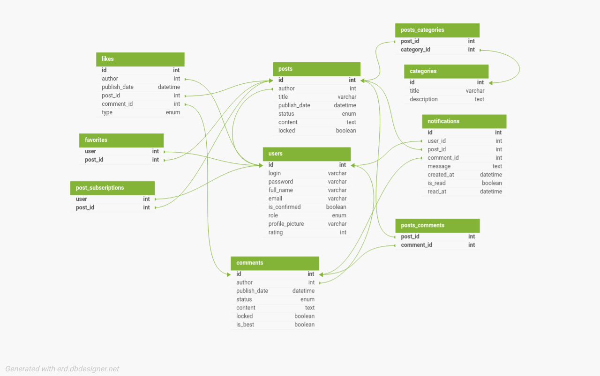
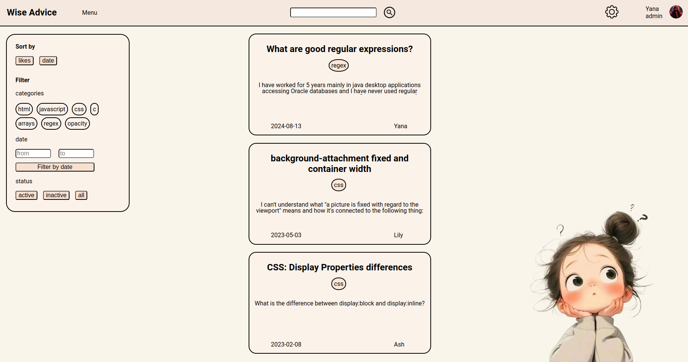
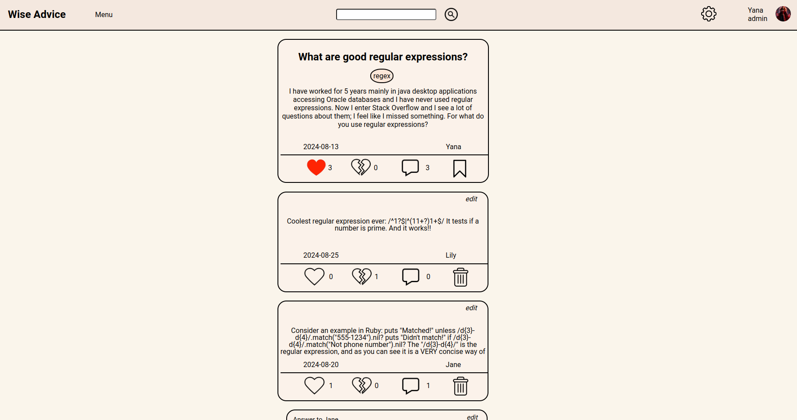
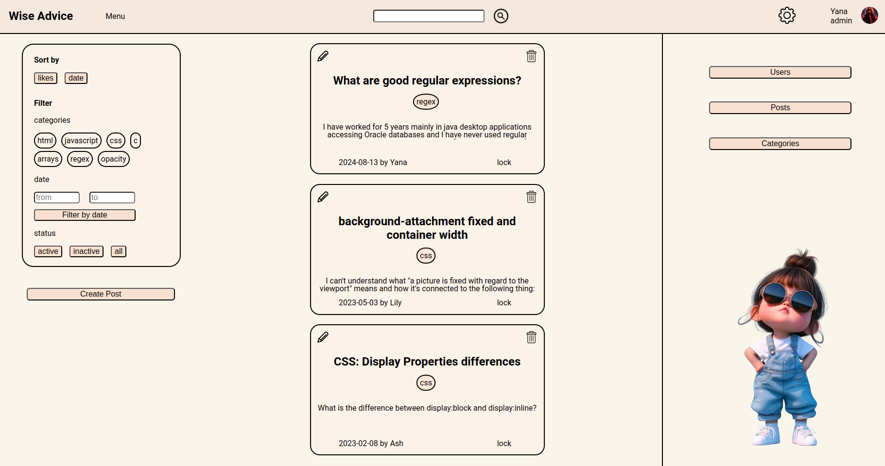

# Wise Advice

This project is a programmer's question-and-answer community for both career-oriented and hobby-driven coders. It allows users to create posts with different categories, comment on them, like or dislike posts and comments, subscribe to posts, add posts to favorites, and get notifications about new posts and comments.

## Requirements and dependencies :wrench:
### Requirements 
- **Node.js** 
-  **MySQL** 
### Dependencies 
The project uses the following npm packages: 
- **bcrypt**: for hashing passwords. 
- **body-parser**: for parsing the request body. 
- **express**: a web framework for Node.js. 
- **jsonwebtoken**: for working with JSON Web Tokens (JWT). 
- **mysql2**: for interaction with MySQL database. 
- **nodemailer**: for sending emails. 
- **dotenv**: to load environment variables from `.env` file.
- **cors**: middleware for enabling Cross-Origin Resource Sharing (CORS) in Express applications, allowing secure requests from different origins.

## How to Run :rocket:

- First of all, you need to clone a repository. To do this, use the `git clone` command:
`git clone git@gitlab.ucode.world:connect-khpi/connect-fullstack-usof-backend/ylevchenko.git`
- Change to the project directory: After cloning the repository, change to the project directory using the cd command.
`cd ylevchenko/API`
- Next, execute the SQL commands from the db.sql file to create the database and tables. To do this, you can use the command below.
`mysql -u root < db.sql`
- After creating the database and tables, insert the test data by executing the SQL commands from the test_data.sql file:
`mysql -u root < test_data.sql`
- Start the server: Use Node.js to start the server. Make sure you have already installed all dependencies as mentioned in the *Requirements and dependencies section*.
 `node server.js`
- Once the server is up and running, you can access the API at http://localhost:5000.
- Next, navigate to the frontend directory:
 `cd ../usof-front`
- Install dependencies:
 `npm install`
- Run the React application:
 `npm start`

##  Description of progress :pencil2:
### :grey_question: Engage 
At this stage, the main idea of ​​the project was defined, which consists in the exchange of knowledge and experience. Team collaboration was found to be important and it was determined that the use of APIs could be useful to implement this concept. The main question that was considered: "How to help people share knowledge?" This became the basis for the further development of this project.
### :mag: Investigate
At this stage, research was conducted to find answers to several key questions that helped in the development of the API. Important functions of websites were explored, and various resources for knowledge sharing were considered. This made it possible to determine which functionalities should be implemented in the project.
### ~ Act: Basic ~
This app is created with an MVC pattern (code organized into Models, Views, and Controllers).

### *Functionality*

#### *User Roles*

**Role: Administrator :sunglasses:**

Administrators have extended access rights that allow them to perform the following actions:

#### Authorization:

- **Log In**: Administrators can log in using their credentials.
- **Log Out**: Administrators can log out of the system.
- **Reset Password**: Administrators can reset their password if needed.

#### Users:

- **Create User/Admin**: Administrators can create new user and admin accounts.
- **View All Profiles**: Administrators can view all user profiles.
- **Update Profile Data**: Administrators can update user profile information.
- **Delete User**: Administrators can delete user accounts.

#### Posts:

- **Create Post**: Administrators can create new posts.
- **View All Posts**: Including inactive posts.
- **Update Post Data**: Change the category or set a post as active/inactive.
- **Lock/Unlock Post**: Administrators can lock or unlock posts to prevent or allow further interactions.
- **Delete Post**: Administrators can delete posts.

#### Categories:

- **Create Category**: Administrators can create new categories.
- **View All Categories**: Administrators can view all categories.
- **Update Category**: Administrators can update category information.
- **Delete Category**: Administrators can delete categories.

#### Comments:

- **Create Comment**: Administrators can create comments.
- **View All Comments**: Administrators can view all comments.
- **Update Comment Status**: Change the status of comments to active/inactive.
- **Lock/Unlock Comment**: Administrators can lock or unlock comments to prevent or allow further interactions.
- **Delete Comment**: Administrators can delete comments.

#### Likes:

- **Create Like**: Administrators can create one like/dislike for any post or comment.
- **View All Likes**: Administrators can view all likes on posts or comments.
- **Delete Like**: Administrators can delete their created likes.

**Role: User :woman_technologist:**

Users have limited access rights that allow them to perform the following actions:

#### Authorization:

- **Register**: Users can register on the website.
- **Log In**: Users can log in using their credentials.
- **Log Out**: Users can log out of the system.
- **Reset Password**: Users can reset their password if needed.

#### Posts:

- **Create Post**: Users can create new posts.
- **View Active Posts**: Users can see only active posts from all users and their own inactive posts.
- **Update Own Posts**: Users can update the category and content of their own posts.
- **Favorite Posts**: Users can add posts to their favorites and view their favorite posts.
- **Subscribe to Posts**: Users can subscribe to posts to receive updates.
- **Delete Own Posts**: Users can delete their own posts.

#### Comments:

- **Create Comment**: Users can create comments under active posts.
- **View Comments**: Users can see all comments for a specified post.
- **Update Comment Status**: Users can change the status of their comments to active/inactive.
- **Delete Comment**: Users can delete their own comments.

#### Likes:

- **Like/Dislike**: Users can create one like/dislike for any post or comment.
- **View All Likes**: Users can see all likes on the specified active post or comment.
- **Delete Own Likes**: Users can delete their own likes.

#### Notifications:

- **View Notifications**: Users can view all notifications related to their activities on the platform.
- **Mark Notifications as Read**: Users can mark specific notifications as read.

**Accessible by Anyone :busts_in_silhouette: :**
- **View Active Posts**: see only active posts from all users.
- **View Specified Post Data**: have the ability to retrieve detailed information about a specific post by providing its unique identifier.
- **View All Comments for the Specified Post**: view all comments associated with a specific post.

#### DB Schema :file_cabinet:

#### Endpoints :globe_with_meridians:
For detailed information on each endpoint, please refer to the Swagger documentation.
You can find it at `docs/open-api.yaml`.

#### Additional functions :sparkles:: 
1. **Lock/Unlock**:
Allows admins to block or unblock posts and comments, disallowing or allowing interaction with them.
2. **Sorting**:
Users can sort posts by number of likes (default) or by date.
3. **Filtration**:
Allows users to filter posts by category, date, and status.

### ~ Act: Creative ~
At this stage, the focus was on implementing additional features that would make the API more unique and useful for users. Several creative features have been implemented that improve the interaction with posts and comments.

#### Additional functions :sparkles::  
1. **Adding posts to the "Favorites" category**: 
Users can add posts to their Favorites, allowing them to quickly view all tagged posts via the appropriate API endpoint. 
2. **Subscribing to posts**: 
Users can subscribe to posts that interest them. This allows them to be notified of any changes or comments to these posts.
3. **Choosing the best comment**:
 Post creators were given the opportunity to choose the best comment for their post. This not only improves the quality of the discussion, but also encourages users to actively participate in commenting.

#### Screenshots

## Author

-   Yana Levchenko
